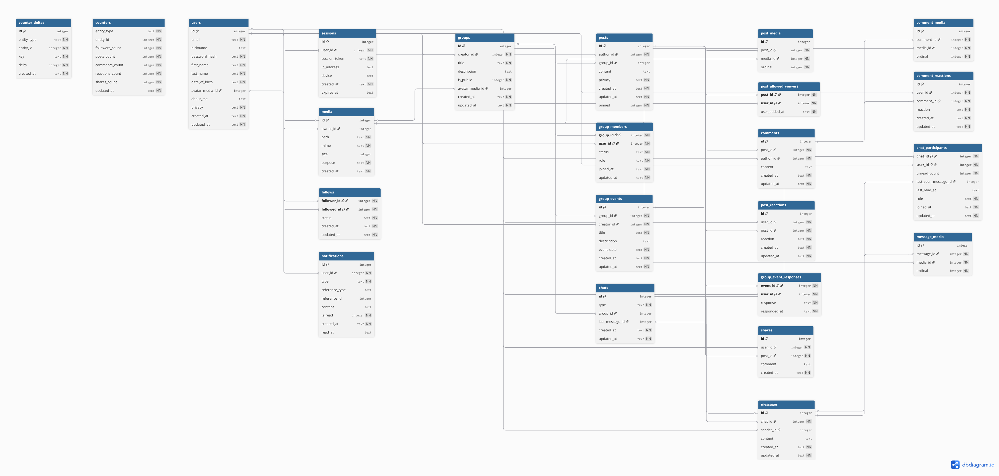

# Social Network Database Schema

This document describes the database structure used by the **Social Network Backend**.  
All timestamps follow the ISO-8601 format: `YYYY-MM-DD HH:MM:SS`.

---

## 🧱 Core Tables

### **users**

Stores all user profiles and account data.

- Includes personal info, avatar, and privacy settings.
- References: `avatar_media_id → media.id`

### **sessions**

Tracks active user sessions and authentication tokens.  

- References: `user_id → users.id`

### **media**

Holds file metadata (avatars, posts, comments, messages).  

- References: `owner_id → users.id`

### **posts**

Main content table for user and group posts.  

- References: `author_id → users.id`, `group_id → groups.id`

### **comments**

Stores user comments on posts.  

- References: `post_id → posts.id`, `author_id → users.id`

### **reactions**

- `post_reactions`: user reactions on posts  
- `comment_reactions`: user reactions on comments

---

## 👥 Social Features

### **follows**

Manages following relationships between users.  

- `status`: `'pending' | 'accepted' | 'declined'`

### **shares**

Tracks when a user shares a post with optional comments.

### **notifications**

Stores notifications for user actions (likes, follows, invites, etc.).

---

## 👪 Groups and Events

### **groups**

User-created communities with optional avatars.  

- `is_public`: `0 | 1`

### **group_members**

Memberships with roles: `'member' | 'admin' | 'owner'`.

### **group_events**

Events created inside groups.  

- References: `group_id → groups.id`

### **group_event_responses**

Tracks user responses to group events (`'going' | 'not_going'`).

---

## 💬 Messaging System

### **chats**

Private or group chats.  

- `type`: `'private' | 'group'`

### **chat_participants**

Tracks users in chats, their roles, and unread messages.

### **messages**

Messages sent inside chats.  

- References: `chat_id → chats.id`, `sender_id → users.id`

### **message_media**

Attachments linked to messages.

---

## 📊 Analytics

### **counters**

Maintains real-time counters (followers, posts, comments, etc.).

### **counter_deltas**

Logs counter changes for analytics and synchronization.

---

## 🔗 Relationships Overview

| From Table | Column | → | To Table | Column |
|-------------|---------|---|-----------|---------|
| sessions | user_id | → | users | id |
| media | owner_id | → | users | id |
| users | avatar_media_id | → | media | id |
| posts | author_id | → | users | id |
| posts | group_id | → | groups | id |
| comments | post_id | → | posts | id |
| comments | author_id | → | users | id |
| follows | follower_id | → | users | id |
| follows | followed_id | → | users | id |
| groups | creator_id | → | users | id |
| group_members | group_id | → | groups | id |
| group_members | user_id | → | users | id |
| messages | chat_id | → | chats | id |
| messages | sender_id | → | users | id |

---

## 🗒 Notes

- **Booleans** are stored as integers (`0 = false`, `1 = true`).
- **Privacy fields** use CHECK constraints for allowed values.
- **All timestamps** use SQLite `CURRENT_TIMESTAMP` by default.

---

## 🧩 ERD Preview

Use [dbdiagram.io](https://dbdiagram.io/d/social-network-68f8f525357668b7321e690e) to visualize this schema.  

---
